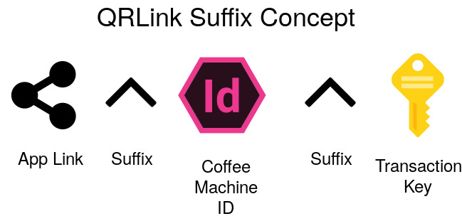

## Описание
### Цель проекта 
Целью проекта CoffeeBreaker является упрощение получения кофейного напитка, посредством исключения баристы из цепочки приготовления кофе.
Мы создали систему, по которой человек может сварить кофе, используя лишь мобильный телефон и наши разработки. Вам лишь нужно просканировать QR-код, скачать наше приложения из Google Play Market'а и использовать этот же код для того, чтобы кофе машина выполнила ваш заказ.

### Наше приложение

### QR-код

## Предполагаемый продукт
Непосредственной целью нашего проекта является создание умной системы CoffeeBreaker, включающую в себя:
1. Мобильное приложение
2. Кофемашина, технически интегрированная в систему IoT.
3. Web-Сервер, осуществляющий взаимосвязь между мобильным приложением и кофемашиной.
4. Базу данных

## Developer Notes
So please feel free to fork it and open pull requests for any fix, improvement or feature you add. 
You may check the [contributing guide](https://github.com/kerusey/CoffeeBreaker/blob/master/CONTRIBUTING.md) for more information on how to do this. 

## CoffeeBreaker team
<table>
  <tr>
    <td align="center"><a href="https://github.com/kerusey"> <b>Danil Likh</b></a> <a href="#maintenance-hamelsmu" title="Maintenance">🚧</a></td>
    <td align="center"><a href="https://github.com/syorito-hatsuki"> <b>Syorito Hatsuki</b></a> <a href="https://github.com/kerusey/CoffeeBreaker/pulls" title="Reviewed Pull Requests">👀</a> <a href="#ideas-dansbecker" title="Ideas, Planning, & Feedback">🤔</a> <a href="#maintenance-dansbecker" title="Maintenance">🚧</a></td>
    
  </tr>
</table>
