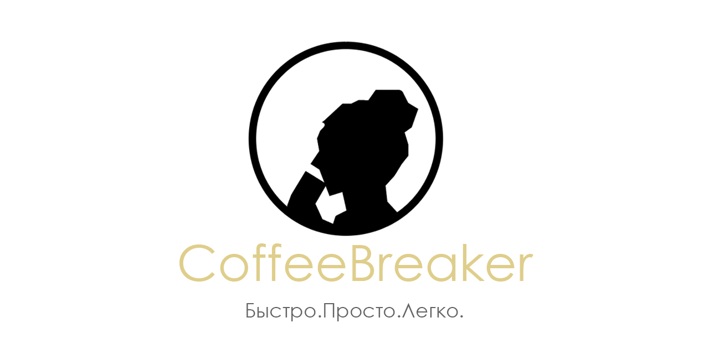

<a href="https://github.com/kerusey/CoffeeBreaker/blob/master/README-RU.md">
Русская версия
</a>

## Description
### Main goal of the project
The aim of the CoffeeBreaker project is to simplify the receipt of coffee drink by excluding barista from the coffee chain. We have created a system where an each person can make coffee using only a mobile phone and our developments. You just need to scan the QR-code, download our apps from Google Play Market and use the same code to allow the coffee machine to fulfill your order
### Our mobile app

## Alleged product
The main idea of ours project is creation of a smart CoffeeBreaker system, which contains:
1. Mobile app
2. IoT integrated coffee machine.
3. Web-Server, witch connects mobile app and the coffee machine
4. DataBase
 

## Developer notes
If you would like to take a part in the project development feel free to fork it and open pull requests for any fix, improvement or feature you add. 
You may check the [contributing guide](https://github.com/kerusey/CoffeeBreaker/blob/master/CONTRIBUTING.md) for more information on how to do this. 

## CoffeeBreaker team
<table>
  <tr>
    <td align="center"><a href="https://github.com/kerusey"> <b>Danil Likh</b></a> <a href="#ideas" title="Ideas, Planning, & Feedback">🤔</a><a href="#maintenance" title="Maintenance">🛠</a><a href="https://github.com/kerusey/CoffeeBreaker/commits?author=kerusey" title="Code">💻</a><a href="https://github.com/kerusey/CoffeeBreaker/commits?author=kerusey" title="Documentation">📖</a></td>
    <td align="center"><a href="https://github.com/syorito-hatsuki"> <b>Syorito Hatsuki</b></a> <a href="#maintenance" title="Reviewed Pull Requests">👀 </a><a href="#maintenance" title="Maintenance">🛠</a><a href="https://github.com/kerusey/CoffeeBreaker/commits?author=syorito-hatsuki" title="Code">💻</a><a href="#projectManagement" title="Project Management">📆</a></td>
    <td align="center"><a href="https://github.com/BlueBlood-dev"> <b>Khaschuk Den</b></a> <a href="#tool" title="Tools">🔧</a><a href="#content" title="Content">🖋</a><a href="https://github.com/kerusey/CoffeeBreaker/commits?author=BlueBlood-dev" title="Code">💻</a>
    <td align="center"><a href="https://github.com/sexualanton10b"> <b>Kettle</b></a> <a href="#content" title="Content">🖋</a><a href="https://github.com/kerusey/CoffeeBreaker/commits?author=sexualanton10b" title="Documentation">📖</a>
      <td align="center"><a href="https://github.com/llav3ji2019"> <b>Pavel Emelyanov</b></a> <a href="#ideas" title="Ideas, Planning, & Feedback">🤔</a><a href="#maintenance" title="Maintenance">🛠</a><a href="https://github.com/kerusey/CoffeeBreaker/commits?author=llav3ji2019" title="Code">💻</a>
    <td align="center"><a href="https://github.com/nzhnme"> <b>Mayya Nuzhnaya</b></a> <a href="#content" title="Content">🖋</a><a href="https://github.com/kerusey/CoffeeBreaker/commits?author=nzhnme" title="Code">💻</a><a href="#tool" title="Tools">🔧</a>
      <td align="center"><a href="https://github.com/Conng"> <b>Max Denisov</b></a> <a href="#content" title="Content">🖋</a><a href="#documentation" title="Documentation">📖</a>
    
  </tr>
</table>
